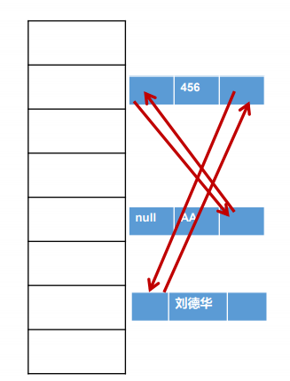
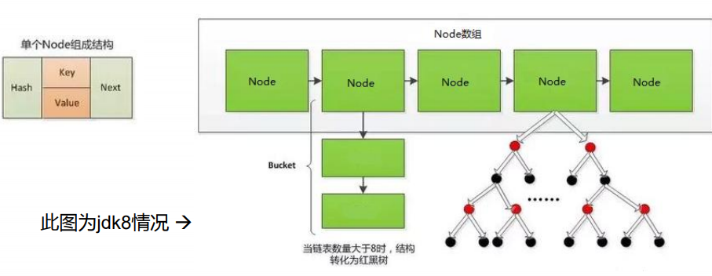
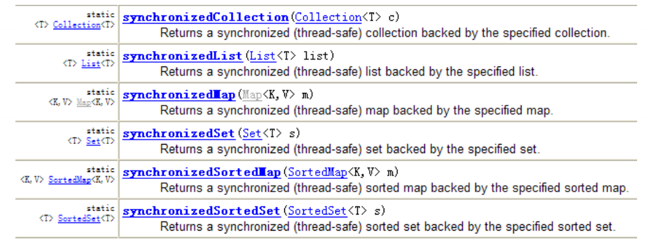

# 集合

[TOC]

___

### 集合框架

##### Java集合框架

* 集合框架包括以下内容：

  1. **接口**：代表集合的抽象数据类型，定义多个接口是为了以不同的方式操作集合对象

     > 如：Collection、List、Set、Map 等

  2. **实现（类）**：集合接口的具体实现

     > 如：ArrayList、LinkedList、HashSet、HashMap

  3. **算法**：是实现集合接口的对象里的方法执行的一些有用的计算

     > 如：搜索和排序

* Java集合有两种特点：

  1. 实现了接口和实现类的分离

  2. 支持泛型，可以限制在一个集合中只能放入同一种数据类型的元素

     > ```java
     > List<String> list = new ArrayList<String>();//只能放入String类型
     > ```

* Java集合框架主要包括两种类型的容器：
  1. 集合`Collection`：存储一个元素集合，包括`List`、`Set`和`Queue`
  
   > List元素有序，可重复
     >
     > Set元素无序，不可重复
  
     ```ascii
     
     ┌──────迭代器──────┐  获取
     │  Iterator     <-┤---------Collection
     |      ▲          | 获取 ┌--------┴---------┐---------┐
     |  ListIterator <-┤--- List               Set     Queue
     └─────────────────┘     |                  |
              ┌-----┌--------┴-----┐        ┌---┴-----┐
          Vector  ArrayList  LinkedList   HashSet   SortedSet
                                            |         |
                                     LinkedHashSet   TreeSet
     
     ┌──对象排序接口─────┐
     │  Comparable     |      ┌──容器工具类────┐
     |                 |      | Collections  |
     |  Comparator     |      └──────────────┘
     └─────────────────┘
     ```
  
  2. 图`Map`：双列数据，存储**键值对映射**(key-value)
  
     ```ascii
                              Map
                      ┌--------┴---┐-----------┐
                 Hashtable      HashMap     SortedMap
                    ▲              ▲           ▲
                    |              |           .
                 Properties   LinkedHashMap   TreeMap
     
     ┌──对象排序接口─────┐
     │  Comparable     |      ┌──容器工具类────┐
     |                 |      | Collections  |
     |  Comparator     |      └──────────────┘
     └─────────────────┘
     ```
  
* Java集合框架位于`java.util`包中，所以使用集合框架时需要导包
  * Java访问集合总是通过统一的方式——迭代器`Iterator`来实现
  * 一部分集合类是遗留类，不应该继续使用
    1. `Hashtable`：一种线程安全的`Map`实现
    2. `Vector`：一种线程安全的`List`实现
    3. `Stack`：基于`Vector`实现的`LIFO`的栈


##### Collection接口方法

1. 添加
   * `add(Object obj)`
   * `addAll(Collection c)`
2. 获取有效元素个数
   * `int size()`
3. 清空集合
   * `void clear()`
4. 是否为空集合
   * `boolean isEmpty()`
5. 是否包含某个元素
   * `boolean contains(Object obj)`：通过元素的`equals`方法来判断是否同一个对象
   * `boolean containsAll(Collection c)`：通过元素的`equals`方法来判断是否同一个对象，挨个比较两个集合的所有元素
6. 删除
   * `boolean remove(Object obj)`：通过元素的`equals`方法判断是否删除的元素，删除找到的第一个元素
   * `boolean removeAll(Collection c)`：取当前集合的差集
7. 取两个元素交集
   * `boolean retainAll(Collection c)`：把交集的结果存在当前集合中，不影响`c`
8. 集合是否相等
   * `boolean equals(Object obj)`
9. **转成对象数组**
   * **`Object[] toArray()`**
10. 获取集合对象的哈希值
    * `hashCode()`
11. 遍历
    * `iterator()`：返回迭代器对象，用于集合遍历


##### 遍历

1. 一般遍历数组都是采用for循环或者增强for，这两个方法也可以用在集合框架
2. 还有一种方法是采用迭代器遍历集合框架，它是一个对象，实现了`Iterator`接口或`ListIterator`接口

> 遍历ArrayList
>
> ```java
> import java.util.*;
> 
> public class Test{
>  public static void main(String[] args) {
>      List<String> testlist = new ArrayList<String>();
>      testlist.add("Hello");
>      testlist.add("World");
>      testlist.add("Goodbye!");
>      
>      //方法1：使用For-Each遍历List
>      for (String str : testlist) { //for(int i=0; i<testlist.size();i++)
>          System.out.println(str);
>      }
>      
>      //方法2：把链表变为数组相关的内容进行遍历
>      String[] strArray = new String[list.size()];
>      testlist.toArray(strArray);
>      for(int i=0;i<strArray.length;i++) { //for(String str : strArray)
>          System.out.println(strArray[i]);
>      }
>      
>      //方法3：使用迭代器
>      Iterator<String> ite = list.iterator();
>      while(ite.hasNext()) {
>          System.out.println(ite.next());
>      }
>  }
> }
> ```
>
> 遍历Map
>
> ```java
> import java.util.*;
> 
> public class Test{
>  public static void main(String[] args) {
>      Map<String, String> map = new Map<String, String>();
>      map.put("1", "value1");
>      map.put("2", "value2");
>      map.put("3", "value3");
>      
>      //方法1：普遍使用，二次取值
>      System.out.println("通过Map.keySet遍历key和value");
>      for(String key : map.keySet()) {
>          System.out.println("key="+key+" and value="+map.get(key));
>      }
>      
>      //方法2
>      System.out.println("通过Map.entrySet使用iterator遍历");
>      Iterator<Map.Entry<String, String>> it = map.entrySet().iterator();
>      while (it.hasNext()) {
>          Map.Entry<String, String> entry = it.next();
>          SYstem.out.println("key="+entry.getKey()+" and value="+entry.getValue());
>      }
>      //方法3：推荐，尤其容量大时
>      System.out.println("通过Map.entrySet遍历key和value");
>      for (Map.Entry<String, String> entry : map.entrySet()) {
>          SYstem.out.println("key="+entry.getKey()+" and value="+entry.getValue());
>      }
>      
>      //方法4
>      System.out.println("通过Map.values()遍历所有的value，但是不能遍历key");
>      for (String v : map.values()) {
>          System.out.println("value=" + v);
>      }
>  }
> }
> ```
>


##### 迭代器Iterator

* `Iterator`对象称为`迭代器`(设计模式的一种)，主要用于遍历集合中的元素

* Collection接口继承了`java.lang.Iterable`接口，该接口有一个`iterator()`方法，那么所有实现了Collection接口的集合类都有一个`iterator()`方法，用以返回一个实现了 `Iterator`接口的对象

* `Iterator`仅用于遍历集合，`Iterator`本身并不提供承装对象的能力

  > 如果需要创建 Iterator 对象，则必须有一个被迭代的集合

* 集合对象每次调用`iterator()`方法都得到一个全新的迭代器对象，**默认游标都在集合的第一个元素之前**

* 迭代器`it`的基本操作是`next`、`hasNext`和`remove`
  * 调用`it.next()`返回迭代器的下一个元素，并更新迭代器的状态
  
    > 在调用`it.next()`方法之前必须要调用`it.hasNext()`进行检测
    >
    > 若不调用，且下一条记录无效，直接调用`it.next()`会抛出`NoSuchElementException`异常
    
  * 调用`it.hasNext()`检测集合中是否还有元素
  
  * 调用`it.remove()`将迭代器返回的元素删除
  
    > 是遍历过程中通过迭代器对象的remove方法，不是集合对象的remove方法
    >
    > 如果还未调用`next()`或在上一次调用`next`方法之后已经调用了`remove`方法， 再调用`remove`都会报`IllegalStateException`
  
* `Iterator`类位于java.util包中，使用前需要引入它

  ```java
  import java.util.Iterator; //引入Iterator类
  ```

* 迭代器的使用

  ```java
  import java.util.ArrayList;
  import java.util.Iterator;
  
  public class IteTest{
      public static void main(String[] args) {
          ArrayList<String> sites = new ArrayList<String>();
          sites.add("Google");
          sites.add("4399");
          sites.add("Zhihu");
          sites.add("Baidu");
          
          //获取迭代器
          Iterator<String> it = sites.iterator();
          //输出集合中的第一个元素
          System.out.println(it.next());
          //输出剩余所有元素
          while (it.hasNext()) {
              System.out.println(it.next());
          }
          
          ArrayList<Integer> numbers = new ArrayList<Integer>();
          numbers.add(12);
          numbers.add(6);
          numbers.add(7);
          numbers.add(15);
          numbers.add(10);
          
          //删除所有小于10的元素
          Iterator<Integer> it2 = numbers.iterator();
          while (it.hasNext()) {
              if (it.next() < 10) {
                  it.remove();
              }
          }
          System.out.println(numbers); //[12, 15, 10]
      }
  }
  ```

* 使用`for each`循环遍历集合类时，Java编译器会将`for each`循环通过`Iterator`改写为普通for循环

  ```java
  List<String> list1 = List.of("Apple", "Orange");
  for (String s : list1) {
      System.out.println(s);
  }
  
  for (Iterator<String> it = list.iterator(); it.hasNext(); ) {
      String s = it.next();
      System.out.println(s);
  }
  ```

  * 好处在于，调用方总是以统一的方式遍历各种集合类型，而不必关系它们内部的存储结构

  > 因为`Iterator`对象是集合对象自己在内部创建的，它自己知道如何高效遍历内部的数据集合，调用方则获得了统一的代码，编译器才能把标准的`for each`循环自动转换为`Iterator`遍历

* 如果我们自己编写了一个集合类，想要使用`for each`循环，只需满足以下条件：

  * 集合类实现`Iterable`接口，该接口要求返回一个`Iterator`对象
  * 用`Iterator`对象迭代集合内部数据

* 一个倒序遍历集合的`Iterator`实例：

  ```java
  import java.util.*;
  
  public class Main {
      public static void main(String[] args) {
          Re
      }
  }
  
  class ReverseList<T> implements Iterable<T> { //Java泛型T
      private list<T> list = new ArrayList<>();
      
      public void add(T t) {
          list.add(t);
      }
      
      @Override
      public Iterator<T> iterator() {
          return new ReverseIterator(list.size());
      }
      
      class ReverseIterator implements Iterator<T> {
          int index;
          ReverrseIterator (int index) {
              this.index = index;
          }
          
          @Override
          public boolean hasNext() {
              return index > 0;
          }
          @Override
          public T next() {
              index--;
              return ReverseList.this.list.get(index);
          }
      }
  }
  ```

  > 然`ReverseList`和`ReverseIterator`的实现类稍微比较复杂，但这是底层集合库，只需编写一次
  >
  > 而调用方则完全按`for each`循环编写代码，根本不需要知道集合内部的存储逻辑和遍历逻辑

  > 在编写`Iterator`的时候，我们通常可以用一个内部类来实现`Iterator`接口，这个内部类可以直接访问对应的外部类的所有字段和方法
  >
  > 例如，上述代码中内部类`ReverseIterator`**可以用`ReverseList.this`获得当前外部类的`this`引用**，然后通过这个`this`引用就可以访问`ReverseList`的所有字段和方法

* 总结
  * `Iterator`是一种抽象的数据访问模型
  * 使用`Iterator`模式进行迭代的好处有：
    * 对任何集合都采用同一种访问模型
    * 调用者对集合内部结构一无所知
    * 集合类返回的`Iterator`对象知道如何迭代


---

### List接口

* 鉴于Java中数组局限性，通常用`List`代替数组
* `List`元素**有序且可重复**，每个元素都对应一个整数型的序号记载其在容器中的位置


##### List接口方法

* `void add(int index, Object ele)`：在index位置插入ele元素 
* `boolean addAll(int index, Collection eles)`：从index位置开始将`eles`中的所有元素添加进来
* `Object get(int index)`：获取指定index位置的元素
* `int indexOf(Object obj)`：返回obj在集合中首次出现的位置
* `int lastIndexOf(Object obj)`：返回obj在当前集合中末次出现的位置
* `Object remove(int index)`：移除指定index位置的元素，并返回此元素
* `Object set(int index, Object ele)`：设置指定index位置的元素为ele
* `List subList(int fromIndex, int toIndex)`：返回从`fromIndex`到`toIndex`位置的左闭右开的子集合

> 常用方法总结：
>
> 增：add(Object obj)
>
> 删：remove(int index)，remove(Object obj)
>
> 改：set(int index, Object ele)
>
> 查：get(int index)
>
> 插：add(int index, Object ele)
>
> 长度：size()
>
> 遍历：Iterator迭代器方式，增强for循环，根据索引长度`list.size()`的普通循环

> ```java
> public void testListRemove() {
>     List list = new ArrayList();
>     list.add(1);
>     list.add(2);
>     list.add(3);
>     updateList(list);
>     System.out.println(list);
> }
> private static void updateList(List list) {
>     list.remove(2); //remove(int index)结果为1,2
>     //list.remove(new Integer(2)); //remove(Object obj)结果为1，3
> }
> ```


##### ArrayList

* `ArrayList`内部使用**动态数组**来存储所有元素

* 当添加元素而数组已满时，会先创建一个更大的数组，然后将就数组的所有元素复制到新数组，然后用新数组取代旧数组

  > JDK1.7创建一个初始容量为10的数组，JDK1.8创建长度为0的数组，当添加第一个元素时再创建初始容量为10的数组

* `List<E>`的主要接口方法
  
  - 在末尾添加一个元素：`boolean add(E e)`
  - 在指定索引添加一个元素：`boolean add(int index, E e)`
  - 删除指定索引的元素：`E remove(int index)`
  - 删除某个元素：`boolean remove(Object e)`
  - 获取指定索引的元素：`E get(int index)`
  - 获取链表大小（**包含元素的个数**）：`int size()`


##### LinkedList

* `LinkedList`通过**带头指针的双向链表**实现了List接口

  > 是双向链表，但不是循环链表

  ```java
  private static class Node<E> {
      E item;
      Node<E> next;
      Node<E> prev;
      
      Node(Node<E> prev, E element, Node<E> next) {
          this.item = element;
          this.prev = prev;
          this.next = next;
      }
  }
  ```

* 由于使用链表，对于频繁的插入或者删除元素操作，建议使用`LinkedList`类，效率较高
* 新增方法：
  * `void addFirst(Object obj)`
  *  `void addLast(Object obj)`
  * `Object getFirst()`
  * `Object getLast()`
  * `Object removeFirst()`
  * `Object removeLast()`


##### Vector

* `Vector`自JDK1.0版本就有了，多数操作与`ArrayList`相同，但`Vector`是**线程安全的**
* `Vector`总比`ArrayList`要慢，所以尽量避免使用
* `Vector`还有一个子类`Stack`
* 新增方法：
  * `void addElement(Object obj)`
  * `void insertElementAt(Object obj,int index)`
  * `void setElementAt(Object obj,int index)`
  * `void removeElement(Object obj)`
  * `void removeAllElements()`


##### 三种List实现类的比较

* 在各种list中，最好把ArrayList作为缺省选择

* 线程安全：

  * ArrayList和LinkedList都线程不安全，相对线程安全的Vector，执行效率高

  * Vector是同步类`synchronized`，属于强同步类，

    > 正常情况下，大多数的Java程序员使用 ArrayList而不是Vector，因为同步完全可以由程序员自己来控制

* 执行效率：
  * ArrayList是实现了基于动态数组的数据结构，对于随机访问`get`和`set`，ArrayList优于LinkedList，因为LinkedList要移动指针
  * LinkedList基于双向链表的数据结构，对于新增和删除操作`add`(特指插入)和`remove`，LinkedList比较占优势，因为ArrayList要移动数据
  * Vector和ArrayList几乎是完全相同的，但Vector是同步类，因此开销比ArrayList要大，访问要慢
  * **Vector每次扩容请求其大小的2倍空间，而ArrayList是1.5倍**


___

### Set接口

* `Set`接口是`Collection`的子接口，没有提供额外的方法

  > [Collection接口方法](#Collection接口方法)

* Set 集合不允许包含相同的元素，如果试把两个相同的元素加入同一个`Set`集合中，则添加操作失败

* Set 判断两个对象是否相同不是使用`==`运算符，而是根据`equals()`方法


##### HashSet

* 是`Set`接口的典型实现，大多数时候使用`Set`集合都是用这个实现类

* 底层也是**数组**，初始容量16，使用率超过75%时，就会扩大容量为原来的两倍

  ```ascii
  ┌---------------数组------------------------>
  |   ┌───────┐───────┐───────┐───────┐───────┐
  |   |   0   |   1   |   2   |   3   |   4   |
  |   └───E───┘───E───┘───E───┘───E───┘───E───┘
  |深             |               |
  |度             E               E
  |               |
  |               E
  |
  ```

  

* 按照`Hash`算法来存储集合中的元素，因此具有很好的存取、查找、删除性能

* 特点：

  * 不能保证元素的排列顺序，即不会记录插入的顺序
  * 不是线程安全的
  * 集合元素可以是`null`

* `HashSet`集合判断两个元素相等的标准：两个对象通过`hashCode()`方法比较相等，并且两个对象的`equals()`方法返回值也相等

  > 即：**“相等的对象必须具有相等的散列码”**

* 添加元素的过程：

  * 当向`HashSet`中存入一个元素时，会调用该对象的`hashCode()`方法来得到该对象的`hashCode`值

  * 根据`hashCode`值，通过某种散列函数决定该对象在`HashSet`底层数组中的存储位置

    > 散列函数会与底层数组的长度相计算得到在 数组中的下标，并且这种散列函数计算还尽可能保证能均匀存储元素，越是散列分布，该散列函数设计的越好

  * 如果两个元素的`hashCode()`值相等，会再继续调用`equals`方法

    * 如果`equals`方法结果为`true`，添加失败
    * 如果为`false`，那么会保存该元素；但是该数组的位置已经有元素了，那么会通过**链表**的方式继续链接

  * **注意**：如果两个元素的equals方法返回true，但它们的hashCode()返回值不相同，那么HashSet会将它们存储在不同的位置，但是依然可以添加成功

    * 但是按照下文，hashCode()方法应该满足“当equals方法返回true时，hashCode()的返回值也相等”

* **重写`hashCode()`方法的原则：**

  * 在程序运行时，同一个对象多次调用`hashCode()`方法应该返回相同的值
  * 两个对象`equals()`方法比较返回`true`时，这两个对象的`hashCode()`方法的返回值也应相等
  * 对象中用作`equals()`方法比较的属性`Field`，都应该用来计算`hashCode`值

* **重写`equals()`方法的基本原则：**

  * 当一个类有自己特有的“逻辑相等”概念，改写`equals()`的时候总是要改写`hashCode()`

    > 否则两个实例可能在逻辑上是相等的，但是根据hashCode()方法，却是两个对象，违反了**“相等的对象必须具有相等的散列码”**

  * 通常参与计算`hashCode()`的对象的属性`Field`，也应该参与到`equals()`中计算

  > 以Eclipse/IDEA为例，在自定义类中可以调用工具自动重写equals和hashCode。 问题：为什么用Eclipse/IDEA复写hashCode方法，有31这个数字？
  >
  > * 选择系数的时候要选择尽量大的系数。因为如果计算出来的hash地址越大，所谓的 “冲突”就越少，查找起来效率也会提高（减少冲突）
  >
  > * 31只占用5bits,相乘造成数据溢出的概率较小。
  >
  > * 31可以由i*31== (i<<5)-1来表示,现在很多虚拟机里面都有做相关优化（提高算法效率）
  >
  > * 31是一个素数，素数作用就是如果我用一个数字来乘以这个素数，那么最终出来的结果只能被素数本身和被乘数还有1来整除！(减少冲突)


##### LinkedHashSet

* `LinkedHashSet`是`HashSet`的子类

* LinkedHashSet不允许集合元素重复

* 同样根据`hashCode`值来决定元素的存储位置，但它同时使用**双向链表维护元素的插入次序**，使得元素看起来是以插入顺序保存的

  > 即，添加元素会以“上一个元素—元素值—下一个元素”的结点的形式存储
  >
  > ```java
  > import java.util.*;
  > 
  > Set set = new LinkedHashSet;
  > set.add(new String("AA"));
  > set.add(456);
  > set.add(456);
  > set.add(new Customer("刘德华", 1001));
  > ```
  >
  > 
  
* LinkedHashSet**插入性能**略低于HashSet，但在迭代访问Set里的全部元素时，有很好的性能

  > 个人理解：双向链表的结构使得迭代非常方便，但是插入时需要增加对链表的操作


##### TreeSet

* `TreeSet`是`SortedSet`接口的实现类，`TreeSet`可以确保集合元素处于排序状态

* TreeSet底层使用**红黑树**的结构存储数据，特点是有序且查询速度比List快
* 新增方法如下（了解即可）：
  * Comparator comparator()
  * Object first()
  * Object last()
  * Object lower(Object e)
  * Object higher(Object e)
  * SortedSet subSet(fromElement, toElement)
  * SortedSet headSet(toElement)
  * SortedSet tailSet(fromElement)

* TreeSet两种排序方法：**自然排序**（默认情况）和**定制排序**

* **自然排序**：TreeSet会调用集合元素的`compareTo(Object obj)`方法来比较元素间的大小关系，然后将元素按照**升序**（默认）排列

  * 当试图将一个对象添加到TreeSet时，该对象的类必须实现**`Comparable`接口**

    > 实现Comparable的类必须实现`compareTo(Object obj)`方法，两个对象即可通过该方法的返回值来比较大小
    >
    > 典型实现：
    >
    > BigDecimal、BigInteger 以及所有的数值型对应的包装类：按它们对应的数值大小 进行比较
    >
    > Character：按字符的unicode值来进行比较
    >
    > Boolean：true 对应的包装类实例大于 false 对应的包装类实例
    >
    > String：按字符串中字符的 unicode 值进行比较
    >
    > Date、Time：后边的时间、日期比前面的时间、日期大

  * 向TreeSet中添加元素时，只有第一个元素无需比较compareTo()方法，后面添加的所有元素都需要调用进行比较

  * **只有相同类的两个实例才会比较大小**，因此TreeSet中添加的应该是**同一个类的对象**

  * 对于 TreeSet 集合而言，它判断两个对象是否相等的唯一标准是：两个对象通过compareTo(Object obj) 方法比较返回值

    > 当需要把一个对象放入TreeSet中，重写该对象对应的equals()方法时，应保证该方法与compareTo(Object obj)方法有一致的结果：
    >
    > 如果两个对象通过equals()方法比较返回 true，则通过compareTo(Object obj)方法比较应返回0，否则让人难以理解

* **定制排序**：自然排序要求元素所属的类实现Comparable接口，如果元素所属的类没有实现Comparable接口，或不希望按照升序(默认情况)的方式排列元素或希望按照其它属性大小进行排序，则考虑使用定制排序
  
  * 定制排序通过**`Comparator`接口**来实现，需要重写`int compare(T obj1, T obj2)`方法
    * 如果返回正整数，则obj1大于obj2
    * 如果返回0，表示相等
    * 如果返回负整数，表示obj1小于obj2
  * 要实现定制排序，需要将实现`Comparator`接口的实例，作为形参转递给TreeSet的构造器
  * 定制排序也只能向TreeSet中添加类型相同的对象，否则发生ClassCastException异常
  * 使用定制排序判断两个元素相等的标准是：通过Comparator比较两个元素返回了0


##### 练习题

* 在List内去除重复数字值，要求尽量简单

  ```java
  public static List duplicateList(List list) {
      HashSet set = new HashSet();
      set.addAll(list);
      return new ArrayList(set);
  }
  public static void main(String[] args) {
      List list = new ArrayList();
      list.add(new Integer(1));
      list.add(new Integer(2));
      list.add(new Integer(2));
      list.add(new Integer(4));
      list.add(new Integer(4));
  	List list2 = duplicateList(list);
      for (Object integer : list2) {
          System.out.println(integer);
      }
  }
  ```


___

### Map接口

* `Map`与`Collection`并列存在，保存具有**映射关系**的数据`key-value`

* `Map`中的`key`和`value`都可以是任何引用类型的数据

* Map中的key用`Set`存放，不允许重复

  > 为了能够判断是否重复，同一个Map对象key所对应的类必须重写hashCode()和equals()方法
  >
  > 为了判断是否包含某一value等，value所对应的类必须重写equals()方法

* 常用String类作为Map的**键**（key）

* Key和Value之间存在单向一对一的关系，即通过指定的key总能找到唯一确定的value

* Map常用的实现类包括：`HashMap`（使用频率最高的实现类）、`TreeMap`、`LinkedHashMap`和`Properties`


##### Map接口方法

* 增删改操作：
  * `Object put(Object key, Object value)`：将指定的key-value添加或修改到当前map对象中
  * `void putAll(Map m)`：将m中所有的key-value对存放到当前的map中
  * `Object remove(Object key)`：移除指定key的key-value对，并返回value
  * `void clear()`：清空当前map中的所有数据
  
* 元素查询操作:
  
  * `Object get(Object key)`：获取指定key对应的value
  * `boolean containsKey(Object key)`：是否包含指定的key
  * `boolean containsValue(Object value)`：是否包含指定的value
  * `int size()`：返回map中key-value对的个数
  * `boolean isEmpty()`：判断当前map是否为空
  * `boolean equals(Object obj)`：判断当前map和参数对象obj是否相等
  
* **元视图操作**：

  * `Set keySet()`：返回所有key构成的Set集合

  * `Collection values()`：返回所有value构成的Collection集合

  * `Set entrySet()`：返回所有key-value对构成的Set集合

  ```java
  Map map = new HashMap();
  //map.put(key, value);省略
  System.out.println("map的所有key");
  Set keys = map.keySet();
  for (Object key : keys) {
      System.out.println(key + "->" + map.get(key));
  }

  System.out.println("map的所有value");
  Collection values = map.values();
  Iterator iter = values.iterator();
  while (iter.hasNext()) {
      System.out.println(iter.next());
  }

  System.out.println("map所有的映射关系");
  //映射关系的类型时Map.Entry类型，它是Map接口的内部接口
  Set mappings = map.entrySet();
  for (Object mapping : mappings) {
      Map.Entry entry = (Map.Entry)mapping;
      System.out.println("Key是" + entry.getKey() + "，value是" + entry.getValue());
  }
  ```

 

##### HashMap

* `HashMap`是Map接口**使用频率最高**的实现类

* **允许使用null键和null值**，与HashSet一样，不保证插入的顺序

* 所有key构成的集合是Set，无序且**不可重复**，**因此key所在的类要重写hashCode()和equals()**

* 所有value构成的集合是Collection，无序但**可以重复**，**因此value所在的类要重写equals()**

  > 因为`boolean containsValue(Object value)`等方法需要调用equals()方法

* 一个key-value构成一个`entry`
* 所有`entry`构成的集合是Set，无序且不可重复

* HashMap**判断两个key相等的标准**是：两个key通过equals()方法返回true，hashCode值也相等
* HashMap**判断两个value相等的标准**是：两个value通过equals()方法返回true

* HashMap的存储结构：

  * JDK 1.7及以前的版本中，HashMap是**数组+链表结构**，即`链地址法`

  > * 当实例化一个HashMap时，系统会创建一个长度为Capacity的`Entry`数组，这个长度在哈希表中被称为容量`Capacity`，在这个数组中可以存放元素的位置我们称之为“桶”`bucket`，每个bucket都有自己的索引，系统可以根据索引快速的查找bucket中的元素
  >
  > * 每个bucket中存储一个元素，即一个Entry对象，但每一个Entry对象可以带一个引用变量，用于指向下一个元素，因此在一个桶中就有可能生成一个Entry链，**而且新添加的元素作为链表的head**
  >
  > * 添加元素的过程：
  >   * 向HashMap中添加entry1(key，value)，需要首先计算entry1中key的哈希值(根据key所在类的hashCode()计算得到)，**此哈希值经过处理以后**，得到在底层Entry[]数组中要存储的位置i
  >   * 如果位置i上没有元素，则entry1直接添加成功；
  >   * 如果位置i上已经存在entry2(或还有链表存在的entry3，entry4)，则需要通过循环的方法，依次比较entry1中key和其他的entry，如果彼此hash值不同，则直接添加成功（因为不同hash值可能映射到同一个存储位置）
  >   * 如果hash值相同，继续比较二者是否equals：如果返回值为true，则使用entry1的value去替换equals为true的entry的value
  >   * 如果遍历一遍以后，发现所有的equals返回都为false，则entry1仍可添加成功，entry1指向原有的entry元素
  > * HashMap的扩容：
  >   * 当HashMap中的元素越来越多的时候，hash冲突的几率也就越来越高，因为数组的长度是固定的
  >   * 所以为了提高查询的效率，就要对HashMap的数组进行扩容
  >   * 而在HashMap数组扩容之后，**最消耗性能**的点就出现了：原数组中的数据必须重新计算其在新数组中的位置，并放进去，这就是`resize`
  > * 决定扩容的时机：
  >   * 当HashMap中的元素个数超过`数组容量 * loadFactor`时，就会进行数组扩容
  >   * loadFactor的默认值(DEFAULT_LOAD_FACTOR)为0.75，这是一个折中的取值
  >   * 默认情况下，数组大小(DEFAULT_INITIAL_CAPACITY)为16，那么当HashMap中元素个数超过160.75=12（这个值就是代码中的threshold值，也叫做**临界值**）的时候，就把数组的大小扩展为2*16=32，即扩大一倍
  >   * 然后重新计算每个元素在数组中的位置，而这是一个非常消耗性能的操作
  >   * 如果我们已经预知HashMap中元素的个数，那么预设元素的个数能够有效的提高HashMap的性能

  * JDK 1.8以后，HashMap是**数组+链表+红黑树**实现

    > 
    >
    > **HashMap中的Node会存储key的hash值**

  > * 当实例化一个HashMap时，会初始化`initialCapacity`和`loadFactor`，在`put`第一对映射关系时，系统会创建一个长度为initialCapacity的`Node`数组，这个长度在哈希表中被称为容量(Capacity)，在这个数组中可以存放元素的位置我们称之为“桶”`bucket`，每个bucket都有自己的索引，系统可以根据索引快速的查找bucket中的元素
  > * 每个bucket中存储一个元素，即一个Node对象，但每一个Node对象可以带一个引用变量next，用于指向下一个元素，因此在一个桶中，就有可能生成一个Node链
  > * 也可能是一个一个TreeNode对象，每一个TreeNode对象可以有两个叶子结点left和right，因此在一个桶中，就有可能生成一个TreeNode树，而新添加的元素作为链表的last，或树的叶子结点
  > * 扩容的时机（与JDK1.7相同）：
  >   * 当HashMap中的元素个数超过`数组容量 * loadFactor`时，就会进行数组扩容
  >   * loadFactor的默认值(DEFAULT_LOAD_FACTOR)为0.75，这是一个折中的取值
  >   * 默认情况下，数组大小(DEFAULT_INITIAL_CAPACITY)为16，那么当HashMap中元素个数超过160.75=12（这个值就是代码中的threshold值，也叫做**临界值**）的时候，就把数组的大小扩展为2*16=32，即扩大一倍
  >   * 然后重新计算每个元素在数组中的位置，而这是一个非常消耗性能的操作
  >   * 如果我们已经预知HashMap中元素的个数，那么预设元素的个数能够有效的提高HashMap的性能
  > * 树形化的时机：
  >   * 当HashMap中的其中一个链的对象个数如果达到了8个，此时如果capacity没有达到64，那么HashMap会先扩容解决
  >   
  >     > 见下方HashMap源码重要常量TREEIFY_THRESHOLD和MIN_TREEIFY_CAPACITY
  >   
  >   * 如果已经达到了64，那么这个链会变成树，结点类型由Node变成TreeNode类型
  >   
  >   * 如果当映射关系被移除后，下次resize方法时判断树的结点个数低于6个，也会把树再转为链表
  > * 映射关系的key是否可以修改：
  >   * 不要修改！
  >   * 映射关系存储到HashMap中会存储key的hash值，这样就不用在每次查找时重新计算每一个Entry或Node（TreeNode）的hash值了
  >   * 因此如果已经put到Map中的映射关系，再修改key的属性，而这个属性又参与hashcode值的计算，那么会导致匹配不上

  * **JDK1.8与之前版本的变动总结：**
    * HashMapmap=newHashMap();//默认情况下，先不创建长度为16的数组
    * 当首次调用map.put()时，再创建长度为16的数组
    * 数组为`Node`类型，在jdk7中称为`Entry`类型
    * 形成链表结构时，新添加的key-value对在链表的尾部（**七头八尾**）
    * 当数组指定索引位置的链表长度>8时，且map中的数组的长度>64时，此索引位置上的所有key-value对使用红黑树进行存储

* HashMap源码中的重要常量

  * DEFAULT_INITIAL_CAPACITY : HashMap的默认容量，16

  * MAXIMUM_CAPACITY ： HashMap的最大支持容量，2^30

  * DEFAULT_LOAD_FACTOR：HashMap的默认加载因子

  * TREEIFY_THRESHOLD：Bucket中链表长度大于该默认值，转化为红黑树

  * UNTREEIFY_THRESHOLD：Bucket中红黑树存储的Node小于该默认值，转化为链表

  * MIN_TREEIFY_CAPACITY：桶中的Node被树化时最小的hash表容量

    > 当桶中Node的数量大到需要变红黑树时，若hash表容量小于MIN_TREEIFY_CAPACITY时，此时应执行resize扩容操作
    
    >
      > 这个MIN_TREEIFY_CAPACITY的值至少是TREEIFY_THRESHOLD的4倍
    
  * table：存储元素的数组，总是2的n次幂

  * entrySet：存储具体元素的集

  * size：HashMap中存储的键值对的数量

  * modCount：HashMap扩容和结构改变的次数

  * threshold：扩容的临界值，=容量*填充因子

  * loadFactor：填充因子

* 面试题：负载因子值的大小，对HashMap有什么影响？

  * 负载因子的大小决定了HashMap的数据密度。
  * 负载因子越大密度越大，发生碰撞的几率越高，数组中的链表越容易长,造成查询或插入时的比较次数增多，性能会下降。
  * 负载因子越小，就越容易触发扩容，数据密度也越小，意味着发生碰撞的几率越小，数组中的链表也就越短，查询和插入时比较的次数也越小，性能会更高。但是会浪费一定的内容空间，而且经常扩容也会影响性能，建议初始化预设大一点的空间。
  * 按照其他语言的参考及研究经验，会考虑将负载因子设置为0.7~0.75，此时平均检索长度接近于常数。


##### LinkedHashMap

* `LinkedHashMap`是`HashMap`的子类

* 在HashMap存储结构的基础上，使用了一对**双向链表**来记录添加元素的顺序

* 类似于LinkedHashSet，LinkedHashMap可以维护Map的迭代顺序，使得迭代顺序与<key, value>对的插入顺序一致

* 内部类的对比：

  * HashMap中的内部类为`Node`

    ```java
    static class Node<K, V> implements Map.Entry<K, V> {
        final int hash;
        final K key;
        V value;
        Node<K, V> next;
    }
    ```

  * LinkedHashMap中的内部类为`Entry`

    ```java
    static class Entry<K, V> extends HashMap.Node<K, V> {
        Entry<K, V> before, after;
        Entry(int hash, K key, V value, Node<K, V> next) {
            super(hash, key, value, next);
        }
    }
    ```


##### TreeMap

* `TreeMap`存储`Key-Value`对时，需要根据key-value对进行排序，保证所有的key-value对处于有序状态

* TreeMap底层使用**红黑树结构**存储数据
* TreeMap的Key排序：
  * **自然排序**：所有的Key必须实现Comparable接口，而且所有key应该是同一个类的对象，否则ClassCastException
  * **定制排序**：创建TreeMap时，传入一个Comparator对象，该对象负责对TreeMap中的所有Key进行排序，此时不需要Map中的Key实现Comparable接口
* 判断两个Key相等的标准：两个key通过compareTo()方法或者compare()方法返回0


##### Hashtable

* JDK1.0就提供的古老的Map实现类
* 与HashMap的相同点：
  * Hashtable实现原理与HashMap相同，功能相同，底层都使用哈希表结构，查询速度快，很多情况可以互用
  * Hashtable与HashMap一样，不能保证其中key-value对的顺序
  * Hashtable判断两个key相等、两个value相等的标准，与HashMap一致
* 与HashMap的不同点：
  * 不同于HashMap，**Hashtable是线程安全的**
  * 不同于Hash Map，Hashtable**不允许使用null作为key和value**


##### Properties

* `Properties`类是Hashtable的子类，该对象用于处理属性文件

* 由于属性文件的key、value都是字符串类型，所以**Properties里的key和value都是字符串类型**

* 存取数据时，建议使用`setProperty(String key, String value)`方法和`getProperty(String key)`方法

  ```java
  Properties pros = new Properties();
  pros.load(new FileInputStream("jdbc.properties"));
  String user = pros.getProperty("user");
  System.out.println(user);
  ```

  


___

### Collections工具类

* `Collections`是一个操作Set、List和Map等集合的工具类
* Collections中提供了一系列静态的方法对集合元素进行排序、查询和修改等操作
* 还提供了对集合对象设置不可变、对集合对象实现同步控制等方法


##### 排序操作

* 均为static方法
* reverse(List)：反转List中元素的顺序
* shuffle(List)：对List集合元素进行随机排序
* sort(List)：根据元素的自然顺序对指定List集合元素按升序排序
* sort(List, Comparator)：根据指定的Comparator产生的顺序，对List集合元素进行排序
* swap(List list, int i, int j)：将指定list集合中的i处元素和j处元素进行交换


##### 查找

* Object max(Collection)：根据元素的自然顺序，返回给定集合中的最大元素
* Object max(Collection, Comparator)：根据Comparator指定的顺序，返回最大元素
* Object min(Collection)
* Object min(Collection, Comparator)
* int frequency(Collection Object)：返回指定集合中，指定元素的出现次数


##### 替换

* void copy(List dest, List src)：将src中的内容复制到dest中
* boolean replaceAll(List list, Object oldVal, Object newVal)：使用新值替换List对象中的所有旧值


##### 同步控制

* Collections类中提供了多个`synchronizedXxx()`方法，该方法可将指定集合包装成线程同步的集合，从而解决多线程并发访问集合时的线程安全问题

  > 